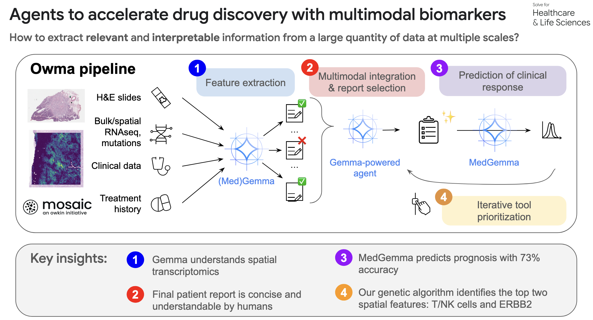

# gdm-hackathon


## Biomarker discovery

Extract interpertable and predictive signal from multi-modal data.




## Set up

- Download the gcloud cli https://cloud.google.com/sdk/docs/install-sdk
- Set the project and authenticate (with your hackathon account)
```bash
gcloud config set project gemma-hcls25par-703
gcloud auth login
```

This way you should be able to push data to our bucket:
```bash
gsutil cp test gs://gdm-hackathon/test
```

## Quickstart

To spawn a local version of the chatbot, run:

```python
curl -LsSf https://astral.sh/uv/install.sh | sh
uv sync 
gradio run_chatbot.py
```

## Spawn a VM on GCP

Go to Compute Engine: In the GCP Console, navigate to Compute Engine -> VM instances.

Create Instance:
- Name: hackathon-workbench.
- Region: eu-west-4
- Machine configuration -> GPU:
    - Click Add GPU.
    - GPU Type: NVIDIA T4 (g4 series)
    - Number of GPUs: 1
- Boot disk -> Change: This is the most important step.
    - Click Change. A new panel will open.
    - Operating system : Deep Learning on Linux
    - Version : I chose "Deep Learning VM for PyTorch 2.4 with CUDA 12.4 M129" (last one)
    - Increase disk size
- Networking: Check the box for Allow HTTP traffic and Allow HTTPS traffic. This is essential to access the web-based IDE.
- Security -> Service Account: Ensure it is set to Compute Engine default service account and that the Access Scope is Allow full access to all Cloud APIs. This lets the VM easily talk to your storage bucket.

Click Create. It will take a few minutes to provision.

You can then connect to the VM via ssh.

## Repository Structure

```
gdm-hackathon/
├── gdm_hackathon/                    # Main package
│   ├── tools/                        # Analysis tools
│   │   ├── clinical_tool.py          # Clinical data loading
│   │   ├── pubmed_tool.py            # PubMed literature search
│   │   ├── medgemma_tool.py          # MedGemma 27B AI model
│   │   ├── evaluation_tool.py        # Tool combination evaluation
│   │   ├── heatmap_report/           # Image analysis tools
│   │   ├── genomic_report/           # Genomic data analysis
│   │   ├── bulk_rnaseq/              # RNA-seq pathway analysis
│   │   └── hipe_report/              # Histopathology analysis
│   ├── models/                       # AI model integrations
│   ├── db/                          # Database utilities (not used)
│   ├── poc/                         # Proof of concept tools
│   └── config.py                    # Configuration settings
├── api.py                           # FastAPI backend server (not used)
├── gradio_chatbot.py                # Gradio web interface
├── genetic_algo_code_agent.py       # Genetic algorithm agent
├── run_chatbot.py                   # Chatbot runner
└── pyproject.toml                   # Project dependencies
```

## Available tools

### Key Features

1. **Multi-modal Analysis**: Combines clinical, genomic, transcriptomic, and histopathological data
2. **AI-Powered Insights**: Uses MedGemma 27B for sophisticated medical analysis
3. **Survival Prediction**: Focused on predicting patient survival outcomes
4. **Tool Combination Optimization**: Genetic algorithm approach to find optimal tool combinations
5. **Scalable Architecture**: Cloud-based storage and computation
6. **Comprehensive Evaluation**: Multiple metrics for assessing prediction accuracy

The tools are specifically designed for bladder cancer biomarker discovery but can be adapted for other cancer types by modifying the data sources and analysis parameters.

### Core Analysis Tools

#### 1. **Clinical Tool** (`clinical_tool.py`)

- **Purpose**: Loads clinical report data from Google Cloud Storage
- **Function**: `load_clinical_report(patient_id)`
- **Data**: Patient demographics, smoking status, histological subtype, cancer stage, medications, radiotherapy history
- **Use Case**: Provides baseline clinical context for survival prediction

#### 2. **PubMed Tool** (`pubmed_tool.py`)

- **Purpose**: Searches PubMed for scientific literature
- **Function**: `search_pubmed(query, max_results=3)`
- **Features**: Returns PMID, title, authors, journal, publication date, and abstract
- **Use Case**: Essential for literature review before selecting report combinations for survival prediction

#### 3. **MedGemma Tool** (`medgemma_tool.py`)

- **Purpose**: Queries the MedGemma 27B model for biomedical analysis
- **Function**: `query_medgemma(prompt, max_tokens=2048, temperature=0.0)`
- **Capabilities**: Analyzes medical reports, predicts survival outcomes, provides medical insights
- **Use Case**: AI-powered analysis of medical data for survival prediction

#### 4. **Evaluation Tool** (`evaluation_tool.py`)

- **Purpose**: Evaluates tool combinations for survival prediction accuracy
- **Functions**: 
  - `evaluate_report_relevance_in_zero_shot(tool1_name, tool2_name)`
  - `seed_genetic_algorithm()`
- **Metrics**: Accuracy, precision, recall, specificity
- **Use Case**: Determines which tool combinations provide the best survival prediction performance

### Specialized Report Tools

#### 5. **Heatmap Report Tools** (`heatmap_report/`)

- **Purpose**: Analyzes medical heatmap images using MedGemma 4B
- **Available Reports**: 24 different heatmap reports including:
  - Gene-specific: CDK12, EGFR, ERBB2, FGFR3, PIK3CA, RB1, TP53
  - Cell type-specific: B-cell, endothelial, epithelial, fibroblast, granulocyte, mast, muscle, plasma, T/NK
  - Feature-specific: IL1B, KRT7, S100A8, malignant bladder, MOMAC
- **Technology**: Uses gemma-3-27b multimodal model for image analysis
- **Use Case**: Spatial analysis of gene expression and cell type distributions

#### 6. **Genomic Report Tools** (`genomic_report/`)

- **Purpose**: Analyzes genomic data for survival prediction
- **Available Reports**:
  - `load_snv_indel_genomic_report` - Single nucleotide variants and insertions/deletions
  - `load_cnv_genomic_report` - Copy number variations
  - `load_cna_genomic_report` - Copy number alterations
  - `load_gii_genomic_report` - Genomic instability index
  - `load_tmb_genomic_report` - Tumor mutational burden
- **Use Case**: Genomic biomarker discovery and analysis

#### 7. **Bulk RNA-seq Pathway Tools** (`bulk_rnaseq/`)

- **Purpose**: Analyzes bulk RNA sequencing data for pathway activity
- **Available Reports**:
  - `load_fgfr3_pathway_report` - FGFR3 pathway analysis
  - `load_egfr_pathway_report` - EGFR pathway analysis
  - `load_pi3k_pathway_report` - PI3K pathway analysis
  - `load_anti_pd1_pathway_report` - Anti-PD1 pathway analysis
  - `load_tgf_beta_pathway_report` - TGF-beta pathway analysis
  - `load_hypoxia_pathway_report` - Hypoxia pathway analysis
  - `load_emt_pathway_report` - Epithelial-mesenchymal transition
  - `load_cell_cycle_pathway_report` - Cell cycle pathway analysis
  - `load_ddr_deficiency_pathway_report` - DNA damage response deficiency
  - `load_p53_pathway_report` - P53 pathway analysis
- **Use Case**: Pathway-level analysis of gene expression data

#### 8. **HIPE Report Tools** (`hipe_report/`)

- **Purpose**: Analyzes histopathological immune infiltration patterns
- **Available Reports**:
  - `load_histopathological_immune_infiltration_report` - Immune cell infiltration analysis
  - `load_histopathological_tumor_stroma_compartments_report` - Tumor-stroma compartment analysis
  - `load_histopathological_tumor_nuclear_morphometry_report` - Nuclear morphometry analysis
- **Use Case**: Histopathological analysis of tissue samples
